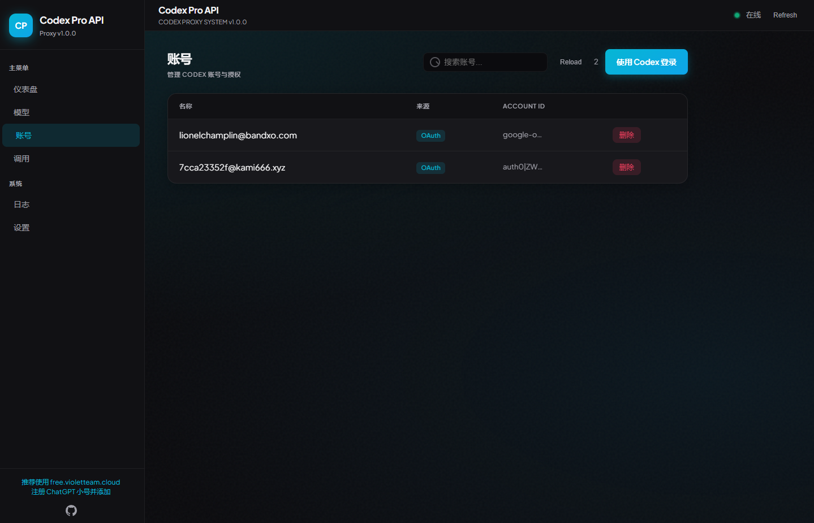
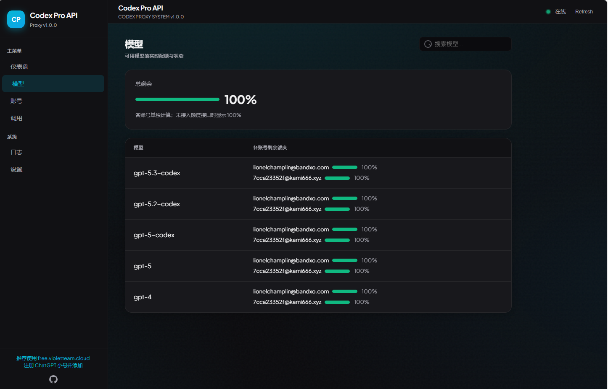

# Codex Pro API

Exposes **Codex** (gpt-5.3-codex) as an **OpenAI-compatible API** so you can use it in Cline, Cursor, or any client that supports OpenAI-style endpoints.

**中文说明请见 [README.zh-CN.md](README.zh-CN.md)。**

---

## Screenshots

**Accounts — add Codex accounts via Login with Codex (OAuth):**



**Models — view available models and quota:**



---

## Prerequisites

- **Node.js** 18 or later

## Run the server

**One command (global install):**

```bash
npm install -g codex-proapi
codex-proapi
```

**Or run from project:**

```bash
npm install
npm start
```

Then open **http://localhost:1455/** in your browser and add Codex accounts via **Login with Codex** (OAuth). The default port is **1455**; set `PORT` if you need another. With global install, account data is stored in `~/.codex-proapi/`.

## Use in your client (Cline, Cursor, etc.)

| Setting   | Value |
|----------|--------|
| **Base URL** | `http://localhost:1455` (or your host/port) |
| **Model**    | `gpt-5.3-codex` (or `gpt-5.2-codex`, `gpt-5-codex`, `gpt-5`, `gpt-4`) |
| **API Key**  | Any value (not validated; auth is from your Codex accounts) |

1. Add accounts at **http://localhost:1455/** by clicking **Login with Codex**.
2. In your client, set the Base URL and model above; API Key can be anything.
3. Send requests as usual; the proxy will use your configured accounts.

No code or server configuration is required beyond adding accounts in the config page.

## Multi-turn and backend format

The proxy talks to ChatGPT’s Codex backend (`chatgpt.com/backend-api/codex/responses`). That backend only accepts **output**-style content (e.g. `output_text`) for **assistant** messages; sending `input_text` for assistant returns 400. So instead of sending assistant messages as separate items, the proxy **flattens** the full conversation into a single user message: it builds one `input_text` whose body is the dialogue with `User:`, `Assistant:`, and `System:` prefixes. Clients keep using the usual OpenAI format `messages: [{role, content}, ...]`; the proxy performs this conversion for multi-turn.

## Features

- **Multi-account round-robin** — Requests are distributed across accounts; one account failure automatically switches to the next (failover).
- **Config page** — Dashboard, Models (quota display), Accounts (OAuth login), Logs (level filter, grep, clear), Settings (language, base URL). Data refreshes every 5 seconds.
- **Responsive UI** — Works on desktop and mobile; sidebar collapses to a menu on small screens.
- **Bilingual** — Interface and log messages in English and 简体中文.

## Using [free.violetteam.cloud](https://free.violetteam.cloud/) for verification

If you use [free.violetteam.cloud](https://free.violetteam.cloud/) to receive verification emails (e.g. when registering a ChatGPT/Codex account), delivery can be a bit slow—please wait patiently. If you still don’t receive the code after a long time, click **Resend verification code**.
